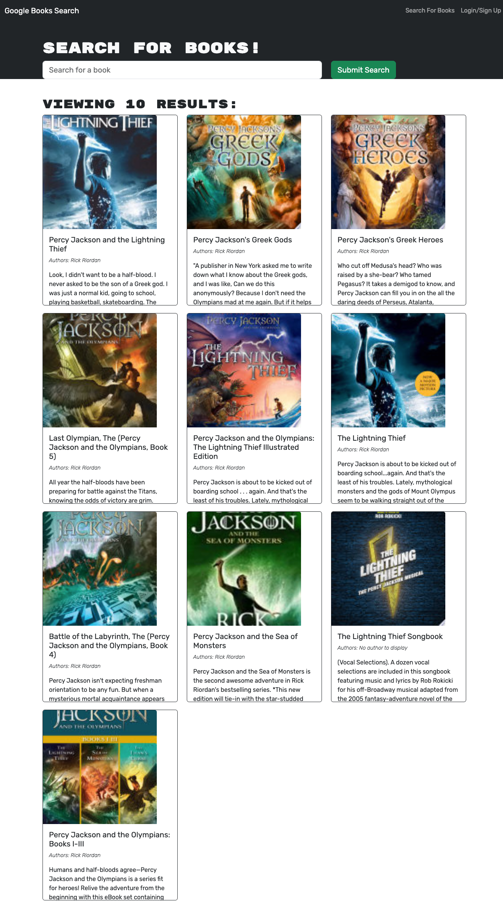

# Book Search Engine Starter Code

  
  
  ## URL
  
  https://bookengine-search-6001a77959d4.herokuapp.com/

  ## Description

  Using Google book search API and GraphQL, this application allows users to search for books and save them to their profile. Users can also delete books from their profile.

  ## Table of Contents

  - [Installation](#installation)
  - [Usage](#usage)
  - [Images](#images)
  - [Credits](#credits)
  - [License](#license)
  - [Tests](#tests)
  - [Questions](#questions)

  ## Installation

  N/A

  ## Usage

  Search for a book! At the bottom of the description if you like it click save. You can view all your saved books and manage them on the saved books page. If you want to delete a book from your saved books click the red button that says delete.
  
  ## Images
  
  
  
  ## License

 This project is licensed under the MIT license. To learn more please visit https://choosealicense.com/licenses/mit/

  ## Credits

  Sam Jones,
  Stack Overflow,
  MDN,
  GraphQl docs

  ## Tests

  N/A

  ## Questions

  If you have any questions about the repo, open an issue or contact me directly at [samejones2018@gmail.com](mailto:samejones2018@gmail.com). You can find more of my work at [ParticularSpace](https://github.com/ParticularSpace).